# ASP.NET

# Homework 1

# Homework 2

# Homework 3

# Homework 4

# Homework 5

# Homework 6

# Homework 7

# Homework 8

# Homework 9

# Homework 10

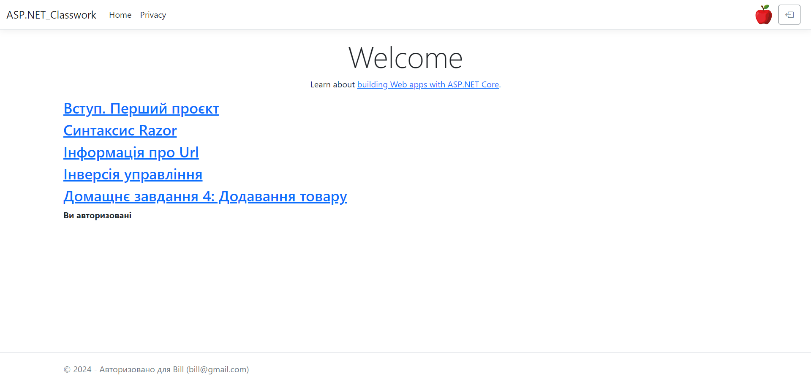

# Homework 11

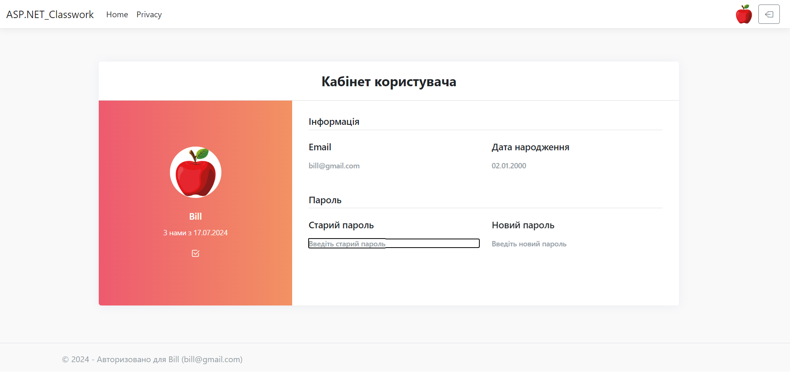

# Homework 12

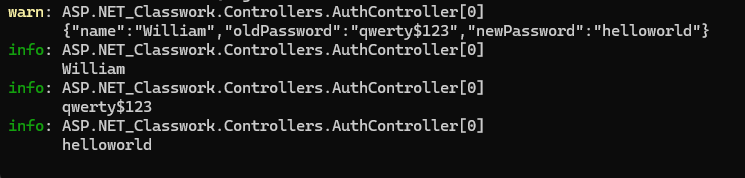

# Homework 13

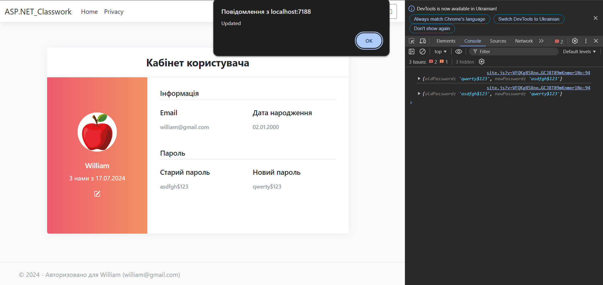

# Homework 14

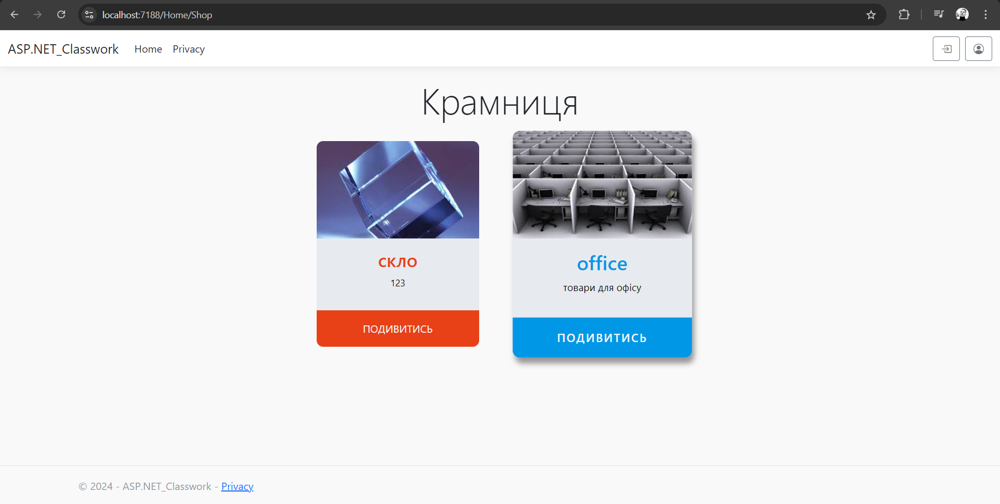

# Homework 15

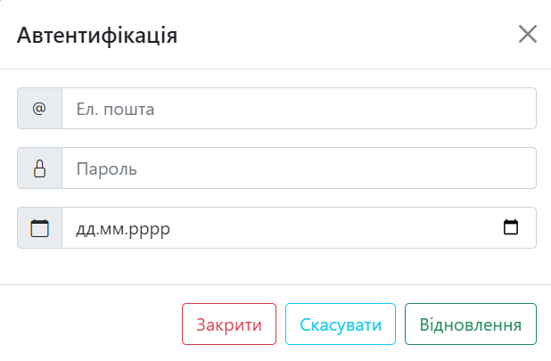

# Homework 16

# Homework 17

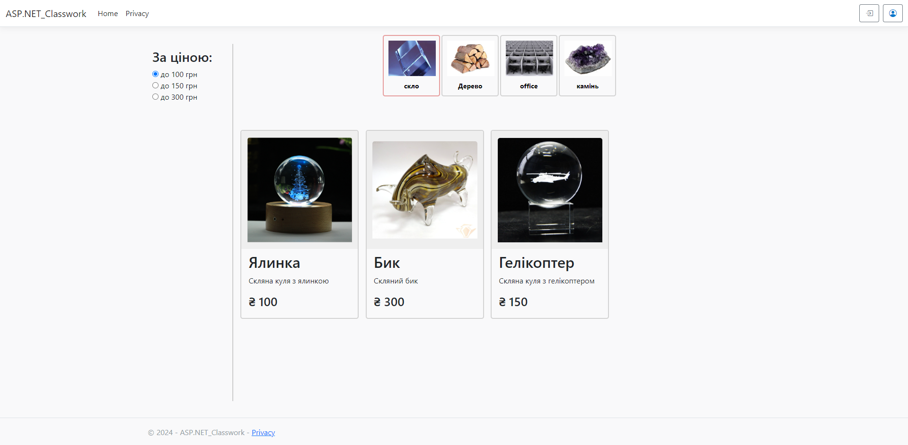

# Homework 18

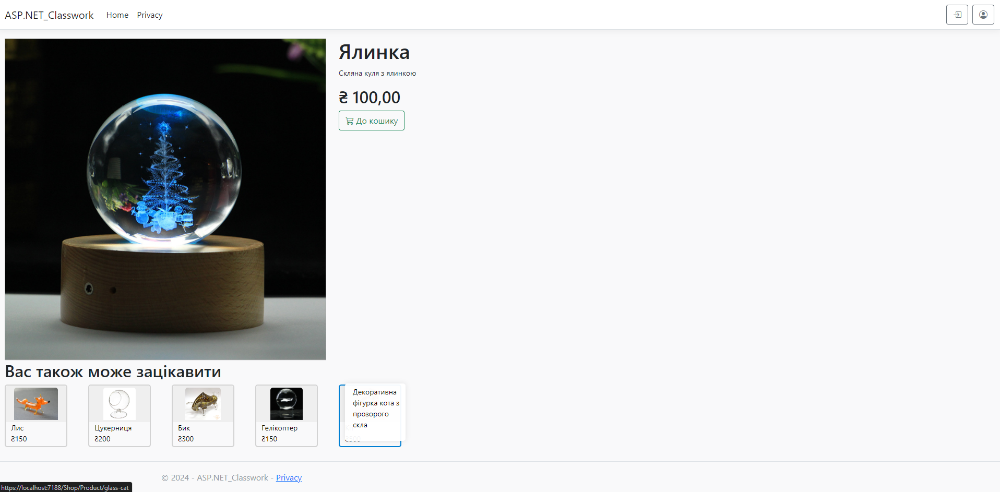

# Homework 19

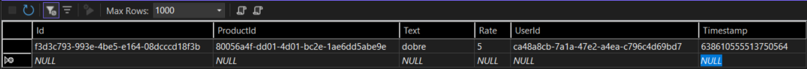

# Homework 20

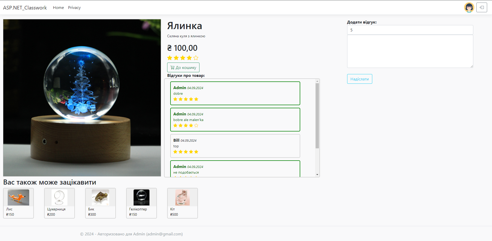
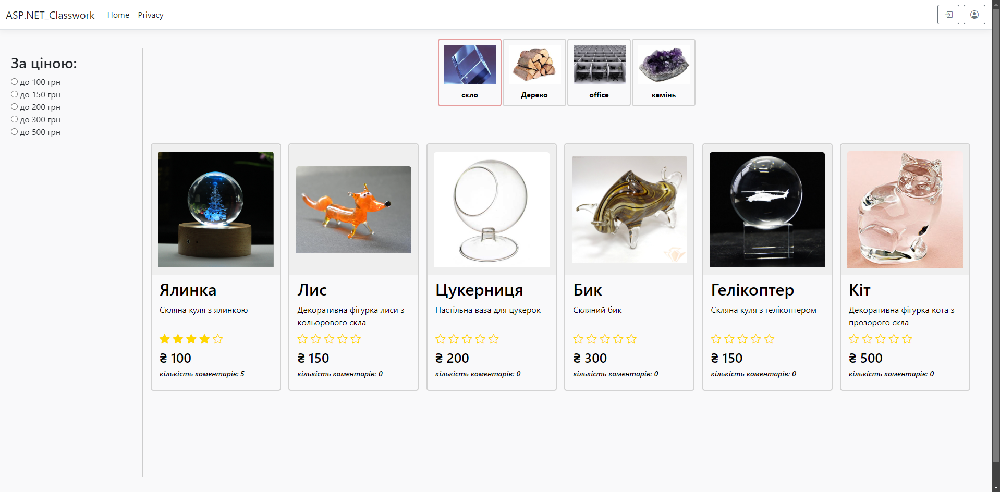
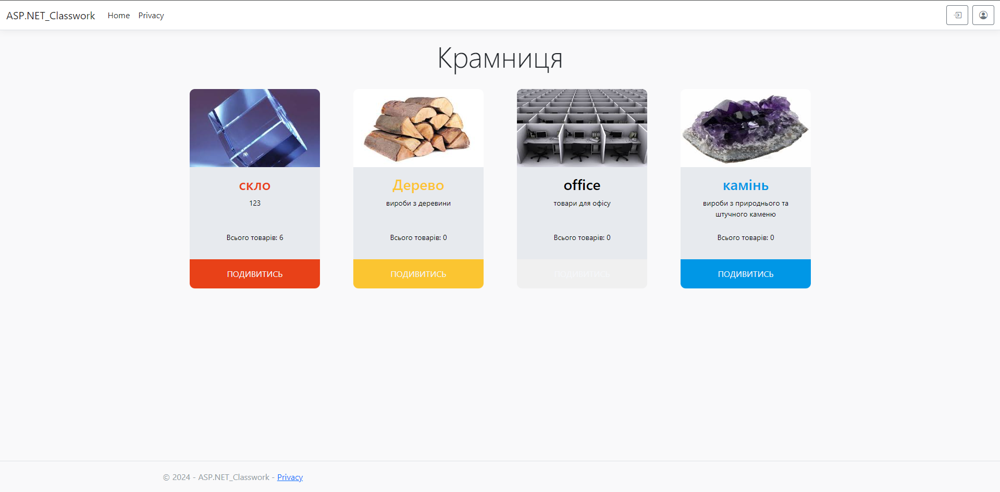

# Homework 21

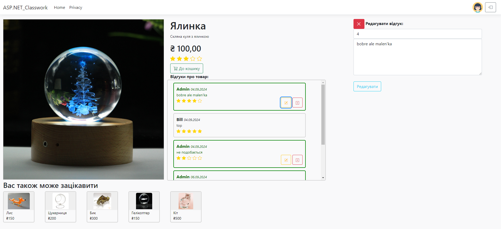
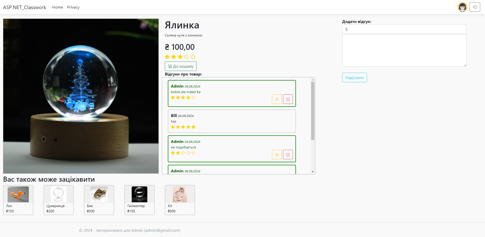

# Homework 22

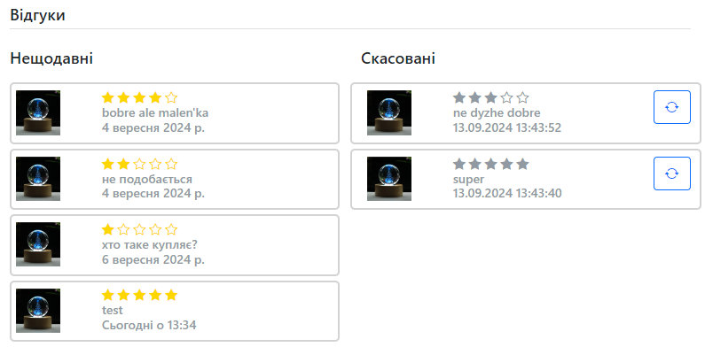

# Homework 23

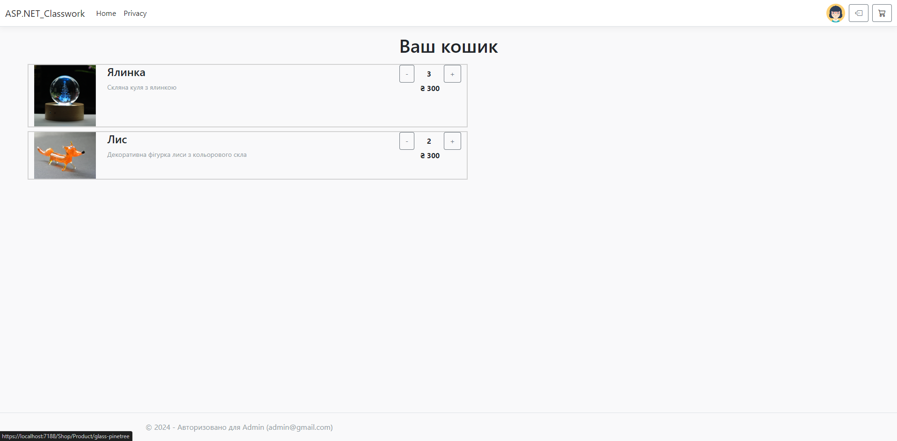